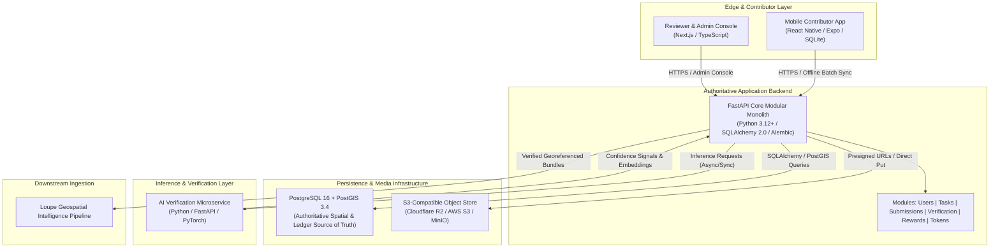

# Horizon — System Architecture Overview

> **Version:** 0.1.0 (Phase 1 — Foundation & System Core)  
> **Status:** Authoritative Foundation Complete  

---

## 1. Executive Purpose

**Horizon** is an offline-first, task-driven geospatial community contribution platform designed to collect verified, georeferenced ground-truth data from distributed contributors and stream that trusted data downstream into **Loupe**'s geospatial intelligence systems.

Horizon bridges critical geospatial data gaps (e.g. unmapped infrastructure, real-time flood defense conditions, rural road passability, urban tree canopy shifts) by incentivizing contributors with an internal token economy governed by cryptographically auditable commitment stakes and verification rewards.

---

## 2. High-Level Architectural Topology

Horizon employs a decoupled, modular monolith backend paired with an isolated AI verification microservice and an offline-first mobile contribution client:



---

## 3. Major Components

### 3.1 Authoritative Backend API (`apps/api`)
- **Technology:** Python 3.12+, FastAPI, Pydantic v2, SQLAlchemy 2.0, Alembic, GeoAlchemy2.
- **Role:** Single authoritative source of truth for all business logic, task claim reservations, user balances, verification states, and reward calculations.
- **Architectural Style:** Modular Monolith. Domain capabilities are organized into modular bounded contexts (`users`, `tasks`, `submissions`, `verification`, `rewards`, `tokens`, `reputation`, `media`) while sharing an ACID relational database.

### 3.2 Contributor Mobile Application (`apps/mobile`)
- **Technology:** React Native, Expo, TypeScript, Local SQLite.
- **Role:** Edge collection tool for contributors.
- **Invariants:**
  - Operates autonomously in zero-connectivity environments.
  - Telemetry and captured forms are cached in local SQLite and enqueued in an offline synchronization queue.
  - Never calculates token payouts, verify decisions, or trust claims locally.

### 3.3 Reviewer & Admin Web Console (`apps/web`)
- **Technology:** Next.js 14, TypeScript, React 18.
- **Role:** Web interface for operational monitoring, reviewer consensus, task lifecycle administration, and token circulation tracking.

### 3.4 Isolated AI Verification Microservice (`services/ai`)
- **Technology:** Python, FastAPI, PyTorch, NumPy, Pillow.
- **Role:** Emits non-authoritative confidence scores, image quality checks, perceptual hashes (pHash), and anti-spoofing signals.
- **Boundary:** Completely isolated from the main application backend. AI models do not write directly to PostgreSQL or make final reward payouts.

### 3.5 Spatial Database & Object Storage
- **Database:** PostgreSQL 16 with PostGIS extension. Enforces strict spatial indexing (GIST) and geometric types (`POINT`, `POLYGON`).
- **Media Storage:** S3-compatible object storage (Cloudflare R2 or AWS S3 in production, MinIO locally). Large photos and sensor telemetry payloads remain outside PostgreSQL.

---

## 4. End-to-End Data Flow

```text
DATA GAP (Task Created)
   │
   ▼
TASK PUBLICATION (Geospatial Polygon + Stake Requirement)
   │
   ▼
COMMUNITY CONTRIBUTOR (Discovers task, stakes commitment tokens)
   │
   ▼
OFFLINE CAPTURE (GPS Telemetry + Form Schema + High-Res Photos)
   │
   ▼
SUBMISSION & RESILIENT BATCH SYNC (Enqueued locally until connected)
   │
   ▼
AUTOMATED VALIDATION (Schema validation, GPS bounds check, EXIF integrity)
   │
   ▼
VERIFICATION PIPELINE (AI anti-spoofing/image signals + Reviewer consensus)
   │
   ▼
REWARD ENGINE (Authoritative reward calculation + Token account credit)
   │
   ▼
VERIFIED GEOSPATIAL DATASET (Clean, enriched, auditable record)
   │
   ▼
LOUPE DATA PIPELINE (Downstream geospatial intelligence ingest)
```

---

## 5. Architectural Separation Invariants

1. **Server Authority:** The backend is the sole authority on token balances, task deadlines, and verification outcomes.
2. **AI Signal Isolation:** The AI service provides recommendations and confidence scores; the core backend business logic retains the authority to accept, reject, or route submissions to human review.
3. **Auditable Token Ledger:** All token movements (grants, stakes, locks, releases, rewards) generate immutable `TokenTransaction` records.
4. **Geospatial Rigor:** All geographic coordinates and coverage boundaries are stored as PostGIS geometries (`SRID 4326`).
